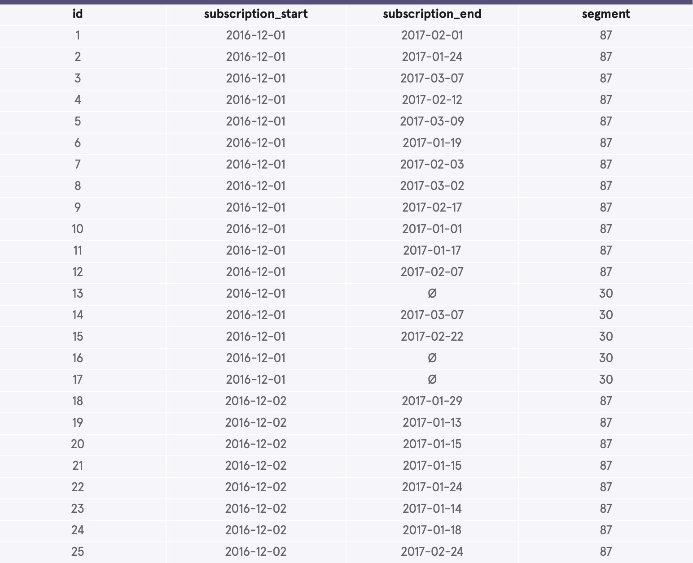
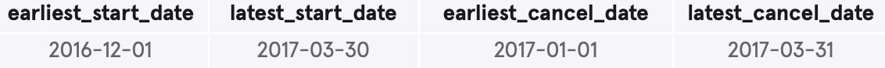
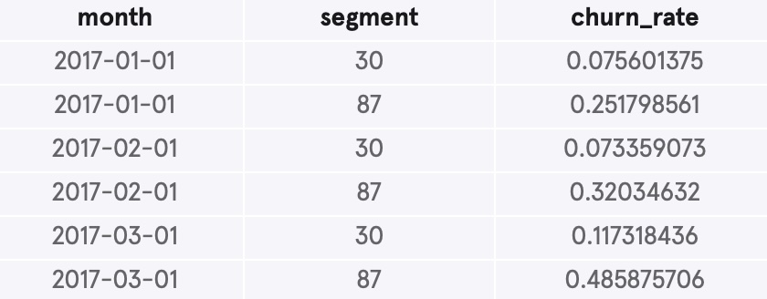

# Codeflix Churn Rate Analysis

## Overview

This project utilizes a customer dataset to analyze and compare the difference in churn rates between two segments of customers by month.

## Business Problem

The purpose of this project is to identify which segment has a stronger retention of customers, as well as the specific months that are strongest. This project identifies the available segments and months in the dataset, then calculate the churn rates for each. 

## Data Understanding

This project uses a dataset titled 'subscriptions'. This dataset contains four columns: customer id, subscription start date, subscription end date (if applicable), and the segments. In the segments column, there are two available segments to compare: 30 and 87. . As the minimum required Codeflix subscription length is one month, the available months for calculating churn rates are January, February, and March. 

## Methods

This project uses descriptive analysis, creating temporary tables, grouping data by segment and month, aggregating subscriptions, and cross joining various tables. This provides key insights for Codeflix to identify which segments and months have the strongest customer retention.


## Conclusions

* 1. Segment 30 had a drastically lower churn rate than segment 87 across all three months.
* 2. Segment 87 saw a steady rise in churn rate each month, while segment 30's churn rate actually decreased from January to February.
* 3. Both segments had a significant jump in their respective churn rates in March. 


## Next Steps

* 1. Investigate the factors that caused such a higher churn rate in segment 87 as compared to segment 30 in order to make changes.
* 2. Investigate the factors that caused a decrease in churn rate for segment 30 from January to February in order to replicate these results more broadly. 
* 3. Investigate the factors that caused a spike in churn rate for both segments in March in order to make adjustments for future months.

## For More Information

Review the data calculations in the [written code](./sql_code) or review this [presentation](./presentation.pdf).

Author: Christopher Miley

June 7, 2025

## Repository Structure

```
├── images
├── README.md
├── sql_code.md
└── presentation.pdf
```